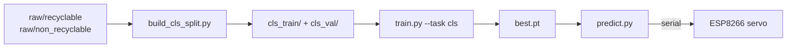

# Phân loại rác tái chế — YOLOv8 Classification + Băng tải thông minh

Hệ thống dùng **YOLOv8 Classification** để phân loại rác thải thành hai lớp, kết hợp camera + ESP8266 + servo để tự động phân loại trên băng tải.

| ID | Lớp | Ý nghĩa |
|----|-----|---------|
| 0 | `recyclable` | Rác thải **tái chế** (giấy, nhựa, kim loại, thủy tinh, carton) |
| 1 | `non_recyclable` | Rác thải **không tái chế** (pin, thực phẩm, quần áo, giày, rác thải khác) |

---

## Luồng dữ liệu



> **Tại sao dùng Classification thay vì Detection?**  
> Dataset gốc là ảnh classification (mỗi ảnh = 1 vật thể, không có tọa độ bbox). Dùng YOLO Detection với nhãn full-frame (`0.5 0.5 1 1`) khiến model luôn vẽ box bằng toàn khung hình. Classification giải quyết đúng bản chất bài toán và không cần label lại.

---

## Yêu cầu

- Python **3.10+**, bản cài **64-bit**
- **Windows:** Python 64-bit từ [python.org](https://www.python.org/downloads/windows/)  
  — GPU NVIDIA: cài PyTorch CUDA theo [pytorch.org](https://pytorch.org/get-started/locally/)
- **macOS Apple Silicon:** Python arm64 để dùng MPS (Metal)

---

## Cài đặt

### Windows (PowerShell)

```powershell
cd D:\Yolov8_recycleTrash
py -3 -m venv .venv
.venv\Scripts\activate
python -m pip install -U pip
pip install -r requirements.txt
```

### macOS

```bash
cd /đường/tới/Yolov8_recycleTrash
python3 -m venv .venv
source .venv/bin/activate
pip install -U pip
pip install -r requirements.txt
```

> **Terminal Windows hiển thị sai tiếng Việt:** bật UTF-8 bằng `$env:PYTHONUTF8=1` trong PowerShell, hoặc vào **Bảng điều khiển → Beta: Use Unicode UTF-8**.

---

## Chuẩn bị dữ liệu

### Bước 1 — Tổ chức ảnh nguồn

Nếu dataset gốc có nhiều thư mục con (`cardboard`, `glass`, `metal`, `paper`, `plastic`, `battery`, ...):

```powershell
python dataset/reorganize_two_class.py
```

Script gộp vào hai thư mục theo quy ước:

| Thư mục | Danh mục gộp vào |
|---------|-----------------|
| `dataset/raw/recyclable/` | cardboard, glass, metal, paper, plastic |
| `dataset/raw/non_recyclable/` | battery, biological, clothes, shoes, trash |

### Bước 2 — Tạo split train/val cho Classification

```powershell
python dataset/build_cls_split.py
```

Tạo ra cấu trúc thư mục chuẩn YOLO Classification:

```
dataset/
  cls_train/
    recyclable/        # ~80% ảnh tái chế
    non_recyclable/    # ~80% ảnh không tái chế
  cls_val/
    recyclable/        # ~20% ảnh tái chế
    non_recyclable/    # ~20% ảnh không tái chế
```

> Script tự **cân bằng 2 lớp** (lấy `min(recyclable, non_recyclable)` ảnh mỗi lớp).

### Cấu trúc đầy đủ

```
dataset/
  dataset.yaml                  # dùng cho detection (không còn cần thiết với cls)
  cls_train/, cls_val/          # dùng cho classification (mới)
  images/train, images/val      # ảnh detection cũ (vẫn giữ)
  labels/train, labels/val      # nhãn detection cũ
  raw/recyclable/
  raw/non_recyclable/
  reorganize_two_class.py
  build_cls_split.py
  build_yolo_split.py
```

---

## Huấn luyện

### Classification (khuyến nghị)

```powershell
python train.py --task cls --epochs 30 --batch 32
```

| Tham số | Mặc định | Ghi chú |
|---------|----------|---------|
| `--task` | `cls` | `cls` = classification, `detect` = detection |
| `--data` | `dataset/cls_train` | Thư mục train (cls) hoặc file yaml (detect) |
| `--model` | `yolov8n-cls.pt` | Weights gốc |
| `--epochs` | `30` | |
| `--imgsz` | `224` | 224 cho cls, 640 cho detect |
| `--batch` | `32` | Giảm nếu hết VRAM |
| `--workers` | `0` | Giữ `0` trên Windows để tránh lỗi WinError 1455 |
| `--resume` | off | Tiếp tục từ `last.pt` sau crash |

**Output:** `runs/classify/waste/weights/best.pt`

### Tiếp tục train sau khi bị crash

```powershell
python train.py --task cls --resume
```

> Script tự tìm `runs/classify/waste/weights/last.pt` và train tiếp từ epoch đã dừng.

### Detection (nếu có bbox thật)

```powershell
python train.py --task detect --epochs 100 --batch 16
```

**Output:** `runs/detect/waste/weights/best.pt`

### Lưu ý Windows — WinError 1455 (paging file too small)

Nếu train bị crash với lỗi:
```
OSError: [WinError 1455] The paging file is too small
```

Nguyên nhân: nhiều dataloader worker cùng load CUDA DLL vào virtual memory.  
Fix đã được áp dụng: `--workers 0` là mặc định (dùng main process thay vì spawn worker).

---

## Đồ thị sau train

```powershell
python plot_training.py
```

→ `runs/detect/waste/training_curves.png` (loss, mAP, precision, recall theo epoch)

> Không cần Tkinter — script dùng backend `Agg` (lưu file PNG, không mở cửa sổ GUI).

---

## Suy luận

`predict.py` **tự động nhận diện** model là classification hay detection và chọn chế độ phù hợp.

### Ảnh / thư mục

```powershell
python predict.py duong/toi/anh.jpg
python predict.py duong/toi/thu_muc/ --save
```

### Webcam — Classification với vùng băng tải

```powershell
python predict.py 0 --show
```

Cửa sổ hiển thị:

```
┌────────────────────────────────────┐
│ recyclable | TAI CHE | 98%          │
│ [████████████████████░░░░]          │
│                                    │
│         ┌──────────────┐           │
│         │ CONVEYOR     │           │
│         │    ZONE      │           │
│         └──────────────┘           │
│                                    │
└────────────────────────────────────┘
```

- **Khung CONVEYOR ZONE (cyan):** vùng target ở giữa khung hình — model chỉ nhìn vùng này để classify, bỏ qua nền xung quanh
- **Banner phía trên:** tên class | TAI CHE / KHONG TAI CHE | % confidence
- **Thanh confidence bar:** xanh lá (tái chế) / đỏ (không tái chế)
- **`WAITING FOR OBJECT...`** khi chưa có vật (confidence thấp hơn `--conf`)
- Nhấn **`q`** để thoát

Điều chỉnh kích thước vùng target:

```powershell
# Vung rong hon (60% khung hinh)
python predict.py 0 --show --center-window-ratio 0.6

# Vung nho hon (30% khung hinh)
python predict.py 0 --show --center-window-ratio 0.3
```

### Tracking Detection (model detect)

Nếu dùng `best.pt` của detection mode:

```powershell
python predict.py 0 --mode track --show
```

Chỉ bám 1 vật thể ở trung tâm:

```powershell
python predict.py 0 --mode track --center-only --show
```

### Tham số hữu ích

| Tham số | Mặc định | Ý nghĩa |
|---------|----------|---------|
| `--conf` | `0.25` | Ngưỡng confidence tối thiểu |
| `--center-window-ratio` | `0.35` | Kích thước vùng target (0–1) |
| `--track-log-every` | `10` | In log mỗi N frame |
| `--track-confirm-frames` | `4` | Chỉ log ID sau N frame ổn định |
| `--save` | off | Lưu ảnh/video kết quả |
| `--device` | auto | `cpu`, `0` (GPU), `mps` |

### Liệt kê camera (khi có nhiều camera)

```powershell
python predict.py --list-cameras
```

---

## Tích hợp ESP8266 — Băng tải thông minh

Firmware mẫu: `arduino/smart_conveyor_sorter.ino`

### Phần cứng

| Linh kiện | Ghi chú |
|-----------|---------|
| ESP8266 (NodeMCU / Wemos D1 mini) | Kết nối USB (CH340 / CP2102) |
| Cảm biến vật cản hồng ngoại E3F | Đầu ra digital; nguồn theo datasheet |
| Servo MG995 / MG996 | Dùng nguồn 5V riêng, GND chung ESP8266 |

### Đấu nối (NodeMCU / Wemos D1 mini)

| Chân | ESP8266 GPIO | Ghi chú |
|------|-------------|---------|
| E3F OUT | **D2** (GPIO4) | `INPUT_PULLUP`; LOW = có vật. **Chỉ 3.3V vào GPIO** — nếu E3F kéo HIGH 5V, dùng chia áp hoặc opto |
| Servo signal | **D5** (GPIO14) | VCC servo từ nguồn 5V ngoài |
| LED trạng thái | **D4** (GPIO2) | LED tích hợp, active LOW |

> ⚠️ GPIO ESP8266 **không chịu 5V**. E3F công nghiệp thường ra mức 5V — phải đảm bảo ngõ vào MCU là 0–3.3V.

### Giao thức serial (115200 baud)

| Hướng | Dữ liệu | Ý nghĩa |
|-------|---------|---------|
| ESP8266 → PC | `TRIGGER` | Cảm biến E3F phát hiện vật |
| PC → ESP8266 | `C:R` | Lệnh phân loại: tái chế |
| PC → ESP8266 | `C:N` | Lệnh phân loại: không tái chế |
| ESP8266 → PC (debug) | `ACK CLASS R\|N`, `PUSH -> R\|N` | Xác nhận |

### Nạp firmware (Arduino IDE 2.x)

1. **File → Preferences → Additional boards manager URLs:**  
   thêm `http://arduino.esp8266.com/stable/package_esp8266com_index.json`
2. **Tools → Board → Boards Manager** → cài **esp8266**
3. Chọn **NodeMCU 1.0** hoặc **LOLIN(WEMOS) D1 R2 & mini**
4. Nạp `arduino/smart_conveyor_sorter.ino`

### Chạy Python + ESP8266

**Windows:**

```powershell
python predict.py 0 --show --serial-port COM3 --serial-baud 115200
```

**macOS:**

```bash
python predict.py 0 --show --serial-port /dev/cu.wchusbserialXXXX --serial-baud 115200
```

Tìm cổng serial:

```powershell
# Windows: xem Device Manager → Ports (COM & LPT)

# macOS:
ls /dev/cu.*
```

---

## Cấu trúc mã

| Đường dẫn | Vai trò |
|-----------|---------|
| `train.py` | Huấn luyện — hỗ trợ `--task cls` (mặc định) và `--task detect` |
| `predict.py` | Suy luận — tự nhận model cls/detect, hiển thị CONVEYOR ZONE |
| `plot_training.py` | Vẽ đồ thị từ `results.csv` → PNG |
| `dataset/build_cls_split.py` | Tạo `cls_train/` + `cls_val/` từ `raw/` |
| `dataset/build_yolo_split.py` | Tạo `images/` + `labels/` (detection, cũ) |
| `dataset/reorganize_two_class.py` | Gộp nhiều lớp con về 2 lớp recyclable/non_recyclable |
| `arduino/smart_conveyor_sorter.ino` | Firmware ESP8266: E3F trigger, nhận C:R/C:N, điều khiển servo |
| `waste_yolo/recycling.py` | Đọc `config/recycling.yaml` |
| `waste_yolo/accelerator.py` | Tự chọn thiết bị CUDA / MPS / CPU |
| `config/recycling.yaml` | Mapping class → tái chế / không tái chế |
| `config/tracker_belt.yaml` | Cấu hình tracker cho detection mode |

---

## Xử lý sự cố

| Lỗi | Nguyên nhân | Fix |
|-----|-------------|-----|
| `WinError 1455` khi train | Nhiều worker cùng load CUDA DLL | Dùng `--workers 0` (đã là mặc định) |
| Train crash giữa chừng | Hết RAM / ngắt điện | Chạy lại với `--resume` |
| `_tkinter.TclError` khi chạy `plot_training.py` | Tkinter không khả dụng | Đã fix: dùng backend `Agg` |
| Model vẽ box full khung hình | Đang dùng detection model với nhãn `0.5 0.5 1 1` | Chuyển sang `--task cls` |
| `WAITING FOR OBJECT...` mãi không hiện kết quả | Vật chưa vào CONVEYOR ZONE hoặc conf thấp | Đặt vật vào vùng cyan, giảm `--conf` |
| Không gửi được ESP8266 | Sai cổng COM / chưa cài `pyserial` | Kiểm tra `--serial-port`, cài `pip install pyserial` |
| Servo rung hoặc reset | Nguồn servo quá yếu | Dùng nguồn 5V ngoài, GND chung |
| Hết VRAM khi train | Batch quá lớn | Giảm `--batch` |

---

## Giấy phép thư viện

[Ultralytics YOLOv8](https://github.com/ultralytics/ultralytics) — AGPL-3.0
