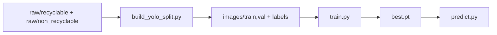

# Phân loại rác tái chế và không tái chế (YOLOv8)

Model **YOLOv8** học trực tiếp **hai lớp**:

| ID | Tên lớp (`dataset.yaml`) | Ý nghĩa |
|----|--------------------------|---------|
| 0 | `recyclable` | Rác thải **tái chế** |
| 1 | `non_recyclable` | Rác thải **không tái chế** |

Khi chạy `predict.py`, mỗi box in **TÁI CHẾ** hoặc **KHÔNG TÁI CHẾ** theo `config/recycling.yaml` (mặc định `recyclable` → tái chế, `non_recyclable` → không tái chế).

---

## Luồng dữ liệu trong repo



1. **Ảnh nguồn hai nhóm** nằm trong `dataset/raw/recyclable/` và `dataset/raw/non_recyclable/`.
2. **`dataset/build_yolo_split.py`** — chia ~80% train / ~20% val, **cân bằng hai lớp** (mỗi lớp lấy cùng số ảnh = min(tái chế, không tái chế)) để model không thiên về “recyclable”. Có `--no-balance` nếu muốn giữ tỉ lệ gốc. Sau khi chạy lại script, **train lại model**.
3. **`python train.py`** — huấn luyện trên `dataset/dataset.yaml` (`nc: 2`).
4. **`python predict.py ...`** — suy luận.

Nếu bạn tải bộ **classification** kiểu nhiều thư mục con (`cardboard`, `plastic`, …) trong `dataset/raw/original/`, chạy **một lần**:

```bash
python dataset/reorganize_two_class.py
```

Script sẽ gộp vào hai thư mục (quy ước mặc định):

- **Tái chế:** `cardboard`, `glass`, `metal`, `paper`, `plastic`
- **Không tái chế:** `battery`, `biological`, `clothes`, `shoes`, `trash`

sau đó **xóa** `raw/standardized_256/` và `raw/standardized_384/` (trùng độ phân giải, không cần cho pipeline này).

---

## Yêu cầu

- Python 3.10+ (khuyến nghị)
- (Tuỳ chọn) GPU NVIDIA + CUDA

---

## Cài đặt

```bash
cd /đường/tới/Yolov8
python3 -m venv .venv
source .venv/bin/activate
pip install -r requirements.txt
```

---

## Chuẩn bị dữ liệu (tóm tắt)

### Cấu trúc

```
dataset/
  dataset.yaml
  images/train, images/val
  labels/train, labels/val
  raw/recyclable/
  raw/non_recyclable/
  reorganize_two_class.py   # gộp từ raw/original/ nhiều lớp (tuỳ chọn)
  build_yolo_split.py        # tạo images + labels từ raw
```

### Định dạng nhãn YOLO

Mỗi `foo.jpg` có `foo.txt`: mỗi dòng `class_id x_center y_center width height` (0–1). Với ảnh **một nhãn cả khung**, dùng một dòng: `0 0.5 0.5 1 1` hoặc `1 0.5 0.5 1 1`.

### File `dataset/dataset.yaml`

`nc: 2`, `names`: `recyclable`, `non_recyclable`. Đổi tên lớp thì sửa đồng thời `config/recycling.yaml` và toàn bộ file `.txt` nhãn.

**Không** thêm dòng `path: .` trong yaml: Ultralytics đặt gốc dataset = thư mục chứa file `dataset.yaml` (thư mục `dataset/`). Nếu thêm `path: .` sai cách, train có thể tìm nhầm `images/` ở thư mục gốc project.

---

## Huấn luyện

Chạy trong **terminal** (không chạy nền) để xem **thanh tiến độ từng batch** và sau mỗi epoch dòng **`>>> Tiến độ`** (mAP, precision, recall). Log ghi vào `runs/detect/waste/`.

```bash
source .venv/bin/activate
python train.py
```

| Tham số | Mặc định |
|---------|----------|
| `--data` | `dataset/dataset.yaml` |
| `--model` | `yolov8n.pt` |
| `--epochs` | 100 |

**Output:** `runs/detect/waste/weights/best.pt`

Trên **Mac Apple Silicon**, nên dùng GPU Metal để nhanh hơn CPU:

```bash
python train.py --device mps --epochs 30 --batch 16
```

(Giảm `--batch` nếu hết bộ nhớ.)

---

## Đồ thị và log sau train

Ultralytics tự lưu trong `runs/detect/waste/`:

- `results.png` — loss / mAP theo epoch
- `confusion_matrix.png` — ma trận nhầm lẫn
- `results.csv` — số liệu từng epoch

Vẽ thêm một file tổng hợp:

```bash
python plot_training.py
```

→ `runs/detect/waste/training_curves.png`

---

## Suy luận

```bash
python predict.py đường/tới/ảnh.jpg --weights runs/detect/waste/weights/best.pt --save
```

Nếu đã có `runs/detect/waste/weights/best.pt`, có thể bỏ `--weights` (mặc định dùng `best.pt`).

### Webcam (camera)

```bash
python predict.py 0
```

Cửa sổ hiển thị luồng; nhấn **`q`** để thoát. Mỗi ~15 frame in log một lần (tên lớp + TÁI CHẾ / KHÔNG TÁI CHẾ).

### Tracking cho băng tải (khuyến nghị)

`predict.py` đã có chế độ `track` để giữ ID ổn định hơn khi vật đi liên tục trên băng tải:

```bash
python predict.py 0 --mode track --tracker config/tracker_belt.yaml --save
```

Với video:

```bash
python predict.py data/conveyor.mp4 --mode track --tracker config/tracker_belt.yaml --save
```

Tham số hữu ích để giảm tracking loạn:

- `--track-confirm-frames 4`: chỉ log ID sau khi xuất hiện đủ N frame.
- `--track-log-every 10`: giảm spam log.
- `--track-max-missed 45`: giữ lịch sử ID qua vài frame mất tạm thời.
- `--conf 0.35` hoặc cao hơn nếu còn nhiều box nhiễu.

### Chi bám 1 vật thể ở giữa khung hình

Nếu băng tải chỉ cần lấy vật thể trung tâm, bật:

```bash
python predict.py 0 --mode track --center-only --tracker config/tracker_belt.yaml --show
```

Tuỳ chỉnh nhanh:

- `--center-window-ratio 0.35`: vùng trung tâm (tỉ lệ so với khung hình).
- `--target-max-missed 20`: giữ lock ID hiện tại trong N frame bị mất trước khi chọn vật mới.

---

## `config/recycling.yaml`

```yaml
classes:
  recyclable: true
  non_recyclable: false
```

Đổi `true`/`false` nếu bạn muốn đảo nghĩa nhãn in (hiếm); tên khóa phải trùng `names` trong `dataset/dataset.yaml`.

---

## Cấu trúc mã

| Đường dẫn | Vai trò |
|-----------|---------|
| `train.py` | Huấn luyện YOLO |
| `predict.py` | Suy luận + in TÁI CHẾ / KHÔNG TÁI CHẾ |
| `plot_training.py` | Vẽ đồ thị từ `results.csv` |
| `waste_yolo/recycling.py` | Đọc `config/recycling.yaml` |
| `dataset/dataset.yaml` | 2 lớp detection |

---

## Xử lý sự cố

- **Hết VRAM:** giảm `--batch` hoặc `--imgsz`.
- **`yolov8n.pt` mặc định:** không khớp dữ liệu của bạn — cần train ra `best.pt` rồi mới dùng cho `predict.py`.

---

## Giấy phép thư viện

[Ultralytics YOLOv8](https://github.com/ultralytics/ultralytics)
