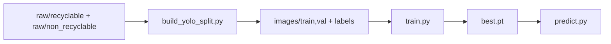

# Phân loại rác tái chế và không tái chế (YOLOv8)

Model **YOLOv8** học trực tiếp **hai lớp**:

| ID | Tên lớp (`dataset.yaml`) | Ý nghĩa |
|----|--------------------------|---------|
| 0 | `recyclable` | Rác thải **tái chế** |
| 1 | `non_recyclable` | Rác thải **không tái chế** |

Khi chạy `predict.py`, mỗi box in **TÁI CHẾ** hoặc **KHÔNG TÁI CHẾ** theo `config/recycling.yaml` (mặc định `recyclable` → tái chế, `non_recyclable` → không tái chế).

---

## Luồng dữ liệu trong repo



1. **Ảnh nguồn hai nhóm** nằm trong `dataset/raw/recyclable/` và `dataset/raw/non_recyclable/`.
2. **`dataset/build_yolo_split.py`** — chia ~80% train / ~20% val, **cân bằng hai lớp** (mỗi lớp lấy cùng số ảnh = min(tái chế, không tái chế)) để model không thiên về “recyclable”. Có `--no-balance` nếu muốn giữ tỉ lệ gốc. Sau khi chạy lại script, **train lại model**.
3. **`python train.py`** — huấn luyện trên `dataset/dataset.yaml` (`nc: 2`).
4. **`python predict.py ...`** — suy luận.

Nếu bạn tải bộ **classification** kiểu nhiều thư mục con (`cardboard`, `plastic`, …) trong `dataset/raw/original/`, chạy **một lần**:

```bash
python dataset/reorganize_two_class.py
```

Script sẽ gộp vào hai thư mục (quy ước mặc định):

- **Tái chế:** `cardboard`, `glass`, `metal`, `paper`, `plastic`
- **Không tái chế:** `battery`, `biological`, `clothes`, `shoes`, `trash`

sau đó **xóa** `raw/standardized_256/` và `raw/standardized_384/` (trùng độ phân giải, không cần cho pipeline này).

---

## Yêu cầu

- Python **3.10+**, bản cài **64-bit** (bắt buộc trên Windows; trên Apple Silicon nên dùng Python **arm64** để dùng MPS).
- **macOS Apple Silicon (M1/M2/M3/…):** GPU qua **MPS** (Metal). Cài Python arm64 từ [python.org](https://www.python.org/downloads/) hoặc Homebrew `arch -arm64 brew install python@3.12` — tránh chạy Python x86_64 qua Rosetta nếu bạn muốn MPS.
- **Windows 11:** Python 64-bit từ [python.org](https://www.python.org/downloads/windows/); (tuỳ chọn) **NVIDIA GPU + CUDA** — xem bước PyTorch bên dưới.

---

## Cài đặt

### macOS (Apple Silicon hoặc Intel)

```bash
cd /đường/tới/Yolov8
python3 -m venv .venv
source .venv/bin/activate
pip install -U pip
pip install -r requirements.txt
```

Kiểm tra Python đang là arm64 (Silicon): `python3 -c "import platform; print(platform.machine())"` → `arm64`.

### Windows 11 (PowerShell hoặc CMD)

```bat
cd C:\đường\tới\Yolov8
py -3 -m venv .venv
.venv\Scripts\activate
python -m pip install -U pip
pip install -r requirements.txt
```

Nếu `py` không có, dùng đường dẫn đầy đủ tới `python.exe` sau khi cài Python.

**GPU NVIDIA (Windows):** bộ `requirements.txt` dùng PyTorch mà Ultralytics kéo từ PyPI (thường là bản CPU trên Windows). Để train/inference nhanh trên CUDA, sau bước trên hãy cài PyTorch đúng phiên bản CUDA theo hướng dẫn trên [pytorch.org](https://pytorch.org/get-started/locally/) (chọn *Windows*, *Pip*, *CUDA* phù hợp driver), rồi chạy lại `pip install -r requirements.txt` nếu cần để đồng bộ `ultralytics`.

**Giao diện tiếng Việt trong terminal Windows:** nếu ký tự lỗi, bật UTF-8: trong PowerShell tạm thời `$env:PYTHONUTF8=1`, hoặc Bảng điều khiển Windows → **Beta: Use Unicode UTF-8**.

Sau khi cài, `train.py` và `predict.py` in một dòng **phát hiện** (CUDA / MPS / CPU) khi bạn không truyền `--device`.

---

## Chuẩn bị dữ liệu (tóm tắt)

### Cấu trúc

```
dataset/
  dataset.yaml
  images/train, images/val
  labels/train, labels/val
  raw/recyclable/
  raw/non_recyclable/
  reorganize_two_class.py   # gộp từ raw/original/ nhiều lớp (tuỳ chọn)
  build_yolo_split.py        # tạo images + labels từ raw
```

### Định dạng nhãn YOLO

Mỗi `foo.jpg` có `foo.txt`: mỗi dòng `class_id x_center y_center width height` (0–1). Với ảnh **một nhãn cả khung**, dùng một dòng: `0 0.5 0.5 1 1` hoặc `1 0.5 0.5 1 1`.

### File `dataset/dataset.yaml`

`nc: 2`, `names`: `recyclable`, `non_recyclable`. Đổi tên lớp thì sửa đồng thời `config/recycling.yaml` và toàn bộ file `.txt` nhãn.

**Không** thêm dòng `path: .` trong yaml: Ultralytics đặt gốc dataset = thư mục chứa file `dataset.yaml` (thư mục `dataset/`). Nếu thêm `path: .` sai cách, train có thể tìm nhầm `images/` ở thư mục gốc project.

---

## Huấn luyện

Chạy trong **terminal** (không chạy nền) để xem **thanh tiến độ từng batch** và sau mỗi epoch dòng **`>>> Tiến độ`** (mAP, precision, recall). Log ghi vào `runs/detect/waste/`.

```bash
source .venv/bin/activate
python train.py
```

| Tham số | Mặc định |
|---------|----------|
| `--data` | `dataset/dataset.yaml` |
| `--model` | `yolov8n.pt` |
| `--epochs` | 100 |

**Output:** `runs/detect/waste/weights/best.pt`

Trên **Mac Apple Silicon**, ưu tiên **MPS**:

```bash
python train.py --device mps --epochs 30 --batch 16
```

(Giảm `--batch` nếu hết bộ nhớ. Một số op có thể fallback CPU; nếu lỗi hiếm với MPS, thử `--device cpu`.)

Trên **Windows 11 có NVIDIA**, sau khi cài PyTorch + CUDA đúng bản, ví dụ:

```bash
python train.py --device 0 --epochs 30 --batch 16
```

`0` là GPU đầu tiên. Không có CUDA: bỏ `--device` hoặc dùng `--device cpu`.

---

## Đồ thị và log sau train

Ultralytics tự lưu trong `runs/detect/waste/`:

- `results.png` — loss / mAP theo epoch
- `confusion_matrix.png` — ma trận nhầm lẫn
- `results.csv` — số liệu từng epoch

Vẽ thêm một file tổng hợp:

```bash
python plot_training.py
```

→ `runs/detect/waste/training_curves.png`

---

## Suy luận

```bash
python predict.py đường/tới/ảnh.jpg --weights runs/detect/waste/weights/best.pt --save
```

Nếu đã có `runs/detect/waste/weights/best.pt`, có thể bỏ `--weights` (mặc định dùng `best.pt`).

### Webcam (camera)

```bash
python predict.py 0
```

(Cố định GPU: thêm `--device mps` trên Apple Silicon hoặc `--device 0` trên Windows có CUDA.)

Cửa sổ hiển thị luồng; nhấn **`q`** để thoát. Mỗi ~15 frame in log một lần (tên lớp + TÁI CHẾ / KHÔNG TÁI CHẾ).

### Tracking cho băng tải (khuyến nghị)

`predict.py` đã có chế độ `track` để giữ ID ổn định hơn khi vật đi liên tục trên băng tải:

```bash
python predict.py 0 --mode track --tracker config/tracker_belt.yaml --save
```

Với video:

```bash
python predict.py data/conveyor.mp4 --mode track --tracker config/tracker_belt.yaml --save
```

Tham số hữu ích để giảm tracking loạn:

- `--track-confirm-frames 4`: chỉ log ID sau khi xuất hiện đủ N frame.
- `--track-log-every 10`: giảm spam log.
- `--track-max-missed 45`: giữ lịch sử ID qua vài frame mất tạm thời.
- `--conf 0.35` hoặc cao hơn nếu còn nhiều box nhiễu.

### Chi bám 1 vật thể ở giữa khung hình

Nếu băng tải chỉ cần lấy vật thể trung tâm, bật:

```bash
python predict.py 0 --mode track --center-only --tracker config/tracker_belt.yaml --show
```

Tuỳ chỉnh nhanh:

- `--center-window-ratio 0.35`: vùng trung tâm (tỉ lệ so với khung hình).
- `--target-max-missed 20`: giữ lock ID hiện tại trong N frame bị mất trước khi chọn vật mới.

---

## Tích hợp Arduino cho băng tải thông minh

Repo đã có firmware mẫu: `arduino/smart_conveyor_sorter.ino`.

### Phần cứng đã hỗ trợ

- Cảm biến vật cản hồng ngoại **E3F 6-36VDC** (đầu ra digital)
- Servo đẩy **MG995 / MG996**
- Vi điều khiển **Arduino Nano V3.0 (CH340G)**

### Cơ chế hoạt động (mới)

Thay vì Python gửi lệnh liên tục theo frame, hệ thống dùng cơ chế **trigger-based** để bám nhịp vật thật trên băng tải:

1. YOLO track vật thể và đưa nhãn vào hàng đợi (`R` / `N`).
2. Khi vật đi tới vị trí gạt, E3F kích hoạt.
3. Arduino gửi `TRIGGER` lên máy tính.
4. Python lấy phần tử đầu hàng đợi và gửi lại:
   - `C:R` = recyclable
   - `C:N` = non-recyclable
5. Arduino điều khiển servo đẩy theo lệnh vừa nhận.

### Giao thức serial

- Arduino -> Python: `TRIGGER`
- Python -> Arduino: `C:R` hoặc `C:N`
- Arduino -> Python (debug): `ACK CLASS R|N`, `PUSH -> R|N`

### Đấu nối tham khảo

- **Servo MG995/MG996**
  - Signal -> `D9` Nano
  - Nguồn servo -> nguồn ngoài 5V đủ dòng
  - GND servo nối chung GND Arduino
- **Cảm biến E3F**
  - OUT -> `D2` Nano
  - GND -> GND chung
  - VCC theo đúng model cảm biến

> Lưu ý: nhiều E3F loại công nghiệp chạy 6-36V, cần đảm bảo mức OUT phù hợp ngõ vào 5V Arduino (qua module đệm/optocoupler/chia áp nếu cần).

### Nạp firmware

Mở Arduino IDE và nạp file:

```bash
arduino/smart_conveyor_sorter.ino
```

### Chạy Python + Arduino

Ví dụ trên **macOS** (cổng USB serial thường là `/dev/cu.*`):

```bash
python predict.py 0 \
  --mode track \
  --center-only \
  --show \
  --serial-port /dev/cu.wchusbserialXXXX \
  --serial-baud 115200 \
  --track-confirm-frames 4
```

Tìm đúng cổng serial:

```bash
ls /dev/cu.*
```

Ví dụ trên **Windows 11** (thay bằng cổng trong Device Manager, ví dụ `COM3`):

```bat
python predict.py 0 --mode track --center-only --show --serial-port COM3 --serial-baud 115200 --track-confirm-frames 4
```

Trong **Device Manager** → Ports (COM & LPT) xem tên cổng của adapter USB–UART (CH340, CP210x, …).

---

## `config/recycling.yaml`

```yaml
classes:
  recyclable: true
  non_recyclable: false
```

Đổi `true`/`false` nếu bạn muốn đảo nghĩa nhãn in (hiếm); tên khóa phải trùng `names` trong `dataset/dataset.yaml`.

---

## Cấu trúc mã

| Đường dẫn | Vai trò |
|-----------|---------|
| `train.py` | Huấn luyện YOLO |
| `predict.py` | Suy luận + in TÁI CHẾ / KHÔNG TÁI CHẾ |
| `arduino/smart_conveyor_sorter.ino` | Firmware Nano: nhận trigger E3F, nhận class từ Python, điều khiển servo |
| `plot_training.py` | Vẽ đồ thị từ `results.csv` |
| `waste_yolo/recycling.py` | Đọc `config/recycling.yaml` |
| `waste_yolo/accelerator.py` | Gợi ý thiết bị PyTorch (CUDA / MPS / CPU) |
| `dataset/dataset.yaml` | 2 lớp detection |

---

## Xử lý sự cố

- **Hết VRAM:** giảm `--batch` hoặc `--imgsz`.
- **`yolov8n.pt` mặc định:** không khớp dữ liệu của bạn — cần train ra `best.pt` rồi mới dùng cho `predict.py`.
- **Không gửi được Arduino:** kiểm tra `--serial-port`, quyền truy cập cổng COM/tty, và đã cài `pyserial`.
- **Servo rung hoặc reset Nano:** dùng nguồn ngoài cho servo, luôn nối chung GND.
- **Đẩy sai nhịp vật:** tinh chỉnh vị trí camera/E3F, `--track-confirm-frames`, và góc servo trong file `.ino`.

---

## Giấy phép thư viện

[Ultralytics YOLOv8](https://github.com/ultralytics/ultralytics)
